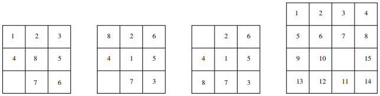

# AStar-PathFinding
School Project: Solving 8 puzzle problem using A* path finding

Instruction on how to run the Prolog file:

1.Load the a2handin file using command [a2handin].\
2.There are 4 default puzzles pre-implemented, namely a, b, c, and d.\
3.We will solve these puzzles using 3 path finding methods: A*, A* with cycle checking, and A* interative deepening. The relative predicates are go( )/2, goCC( )/2, and goIDA( )/2.\
4.Two heuristic functions I have created, they are misplaced and manhattan_distance.\
5.You can test the puzzles by querying the Prolog, for example: goIDA(a, hfn_manhattan).\
6.Try out yourself and see if the puzzle is actually solvable!

 The four pre-implemented puzzles: a, b, c, d

